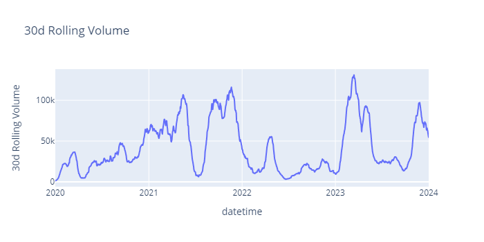
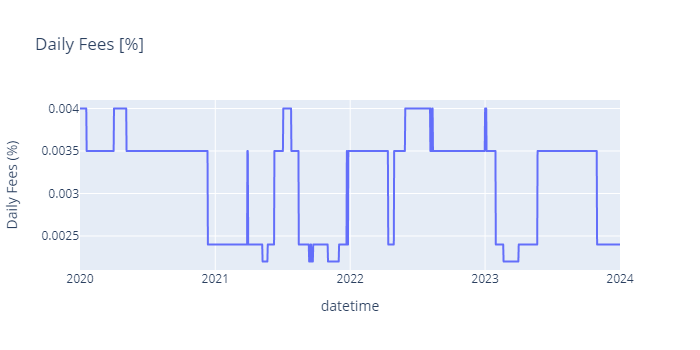
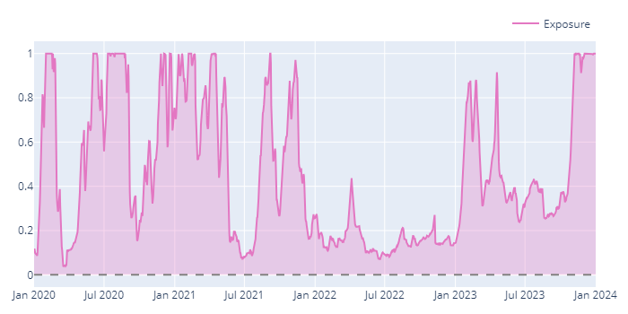
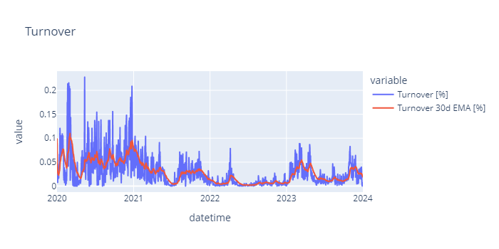
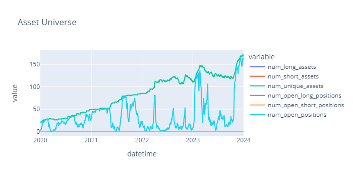
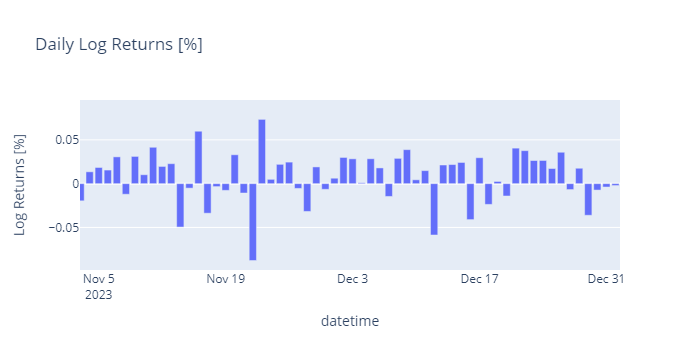
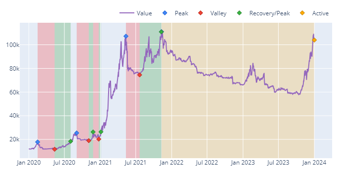
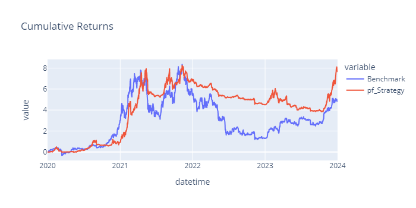
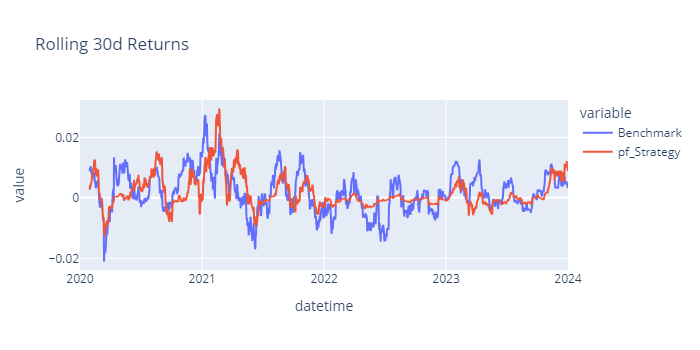

# Backtesting

Backtesting in this repo augments the [vectorbt](https://github.com/polakowo/vectorbt) / [vectorbtpro](https://vectorbt.pro/) backtesting engine with some additional features:

  - Order Fill Volume Constraints (% of available volume)
  - Dynamic Fees (e.g. based on rolling 30d trading volume)
  - Rebalancing Buffers (rebalance to edge of buffer)
  - Adjustable Rebalancing Frequency

This engine operates on binned data (OHLCV) and by default will process orders at the same frequency as the data (e.g. 1h OHLCV data `-->` hourly rebalancing, 1d OHLCV data `-->` daily rebalancing). It is not event-driven. A backtest can be run with the command:

```
bazel run //momentum:momentum -- backtest \
    --input_path {input_OHLCV_CSV_path} \
    --data_freq {OHLCV_timeframe} \
    --start_date {backtest_start_date} \
    --end_date {backtest_end_date} \
    --timezone {desired_timezone} \
    --params_path {params_YAML_path} \
    --initial_capital {initial_capital}
```

- `--input_path`: Path to OHLCV CSV file.
- `--data_freq`: Frequency of OHLCV data (e.g. 1h, 1d).
- `--timezone`: Timezone with which to resample data. Defaults to UTC.
  - If specified, frequency of OHLCV data must be at least 1h or finer, else non-default timezone will be ignored.
- `--params_path`: Path to YAML file containing signal / position generation parameters, see [Backtest Parameter Specification](#parameter-specification) and [Position Generation Parameter Specification](./signal-position-generation.md#parameter-specification).
- `--initial_capital`: Initial account size in base currency.
- `--start_date`: (Optional) Date at which to start backtest, inclusive.
  - Exact datetime is set to midnight in input `timezone` on this date.
  - Leave blank to include all data from the start of the file.
- `--end_date`: (Optional) Date at which to end backtest, exclusive.
  - Exact datetime is set to midnight in input `timezone` on this date.
  - Leave blank to include all data up to the end of the file.
- `--skip_plots`: (Optional) Whether to skip [generating plots](#plots) and only output a summary of performance stats.


## How orders are filled

Positions are expected to be specified as a percentage of the overall portfolio. Positions generated for backtesting should be [lagged by 1 day](./signal-position-generation.md#position-lagging) to avoid lookahead bias. Orders are filled using open prices. Thus, the simulation resembles a live trading process of producing positions from the previous day's data and executing immediately.

Positions are originally generated into a long dataframe with one row for each `(<datetime>, <ticker>)` combination. Each row contains, among other fields, a backtesting price, volume traded, and target size for the ticker at the particular datetime. For backtesting, this dataframe is transformed from long to wide (with exactly one row for each unique `datetime` and a separate column for each `ticker`) and then split into separate dataframes for price, volume, and size. The backtesting engine operates on these wide dataframes.

Each order for `ticker` on `datetime` is processed sequentially. For each order, the target size is translated from a target % of the portfolio to a target amount in the base currency (USD) based on (1) the portfolio's current value in the base currency and (2) the asset's current price. The amount of units to be traded is then computed by subtracting the current position [USD] from the target [USD] and dividing by the price.

$$
\begin{aligned}
s_p &:= \text{target size [\\% of portfolio]} \\
s_b &:= \text{target size [base currency]} \\
c_b &:= \text{current size [base currency]} \\
c_a &:= \text{current size [units of assets]} \\
p &:= \text{price of asset [base currency]} \\
V &:= \text{portfolio value [base currency]} \\
t_b &:= \text{trade size [base currency]} \\
t_a &:= \text{trade size [units of asset]} \\
\\
s_b &= s_p \cdot V \\
c_b &= c_a \cdot p \\
t_b &= s_b - c_b \\
t_a &= t_b / p \\
    &= \frac{s_p \cdot V}{p} - c_a
\end{aligned}
$$

The call sequence is ordered such that sell orders are executed before buy orders for each `datetime`. This maximizes the available capital for buy orders and minimizes the chance that a buy order is not executed due to insufficient funds (this can also be avoided by using [enough leverage](#leverage)).


### Rebalancing Buffers

Rebalancing buffers can be specified to limit unnecessary trading. Trades will only be executed if the deviation between the target size [\% of portfolio] and the current size [\% of portfolio] exceeds the rebal buffer [\% of portfolio]. If so, the position will be rebalanced to the edge of the buffer surrounding the new target and not to the target itself.

$$
\begin{aligned}
s_a &:= \text{target size [units of asset]} \\
c_p &:= \text{current size [\\% of portfolio]} \\
t_p &:= \text{trade size [\\% of portfolio]} \\
d_p &:= \text{position deviation [\\% of portfolio]} \\
r_p &:= \text{rebalancing buffer [\\% of portfolio]} \\
\\
c_p &= \frac{c_b}{V} = \frac{c_a \cdot p}{V} \\
d_p &= \| s_p - c_p \| \\
s_{p,new} &= \begin{cases}
c_p,       & d_p <= r_p\\
s_p - r_p, & d_p > r_p,\ s_p > c_p \\
s_p + r_p, & d_p > r_p,\ s_p < c_p
\end{cases} \\
\\
t_p = s_{p,new} - c_p &= \begin{cases}
0,       & d_p <= r_p\\
s_p - r_p - c_p, & d_p > r_p,\ s_p > c_p \\
s_p + r_p - c_p, & d_p > r_p,\ s_p < c_p
\end{cases} \\
t_a &= t_b / p \\
    &= (t_p \cdot V)/p
\end{aligned}
$$


### Volume Constraints

Filled volume can be constrained as a percentage of the actual traded volume for `ticker` on `datetime`. Order sizes which exceed the imposed volume constraint will be partially executed at the constrained volume size. This helps to prevent overly optimistic / unrealistic fills.

$$
\begin{aligned}
v_m &:= \text{max volume constraint [\\% of available volume]}\\
v_a &:= \text{available volume [units of asset]} \\
m_a &:= \text{max trade size [units of asset]} \\
\\
m_a &= v_m \cdot v_a \\
t_{a,new} &= \text{clip}(t_a, -m_a, m_a) \\
          &= \max(-m_a, \min(t_a, m_a))
\end{aligned}
$$

Note that this implies a large position may be entered / exited over the course of several `datetime` bins depending on the available liquidity (assuming the target position remains stable over that time).


### Leverage

By default, buy orders are executed sequentially until the portfolio runs out of capital, after which subsequent buy orders for the `datetime` are skipped. As mentioned earlier, orders are sequenced such that sell orders are executed before buy orders to maximize available capital for the latter. In addition, a leverage factor can be specified to increase the portfolio's effective buying power in simulation.

Note that leverage in this context **does not** automatically scale up the portfolio size (e.g. a leverage of 2 does not imply that all target positions will be doubled in size), only the portfolio's effective working capital. Scaling up positions should be done during [position generation](./signal-position-generation.md) via e.g. higher volatility targets, and the leverage specified in the backtest should be configured to ensure that all trades with sufficient liquidity can be filled.

Cost of borrow is assumed to be 0. This may be applicable for simulating situations in which an additional cash buffer is kept outside of the portfolio for the sole purpose of executing orders (i.e. situations in which you're not really borrowing money). Alternatively, this cost could be modeled as either a fixed fee per trade or with a new dynamic fee structure.


### Fees

Constant fees are set at 0 fixed (no flat fees) and 50 basis points of slippage (0.5% penalty on fill price for each order).

Dynamic fees are implemented to reproduce [Kraken's Fee Schedule](https://www.kraken.com/features/fee-schedule#kraken-pro). With this fee schedule, per-trade fees are charged based on rolling 30-day trade volume in USD as well the order type (maker vs taker).

In order to estimate rolling trade volume, we first run a simulation over the entire period using only constant fees (i.e. only slippage) and extract the USD volume traded per period. From this, we construct a rolling sum of USD trading volume over a 30 day window which can be used to derive the dynamic per-trade fee charged by Kraken for each period. We then run a second simulation incorporating the dynamic fee schedule in addition to the constant fees.

This method is not entirely accurate since:

1. Trading volume depends on account size, which will be impacted by fees paid for earlier trades. Thus the rolling 30-day trade volume estimate slightly overestimates reality.
2. A change in the fee tier within a period won't take effect in the backtest until the next period, whereas in live trading it would take effect immediately.

However, it should be a reasonable enough approximation to still be useful.

Finally, maker fees are significantly lower than taker fees, but it can be difficult to reason about how this impacts your fills and your slippage. To be conservative, the backtest uses the taker fee schedule by default.


## Rebalancing Frequency

By default, the portfolio will be rebalanced at the same frequency as the data. If positions are generated per hour using 1h OHLCV data, the portfolio will be rebalanced every hour. It is possible to specify a rebalancing period that differs from the data frequency with the [`rebalancing_freq` param](#rebalancing-frequency), in which case the backtesting engine will skip processing those rows which do not meet the rebalancing cadence.

For example, with 1h OHLCV data and a `rebalancing_freq = 1d`, the (wide) dataframes will be downsampled to keep 1 of every 24 rows starting from the first available `datetime` before being passed into the backtesting engine.


## Benchmark Portfolio

A benchmark portfolio can be specified for comparison. Currently the only supported benchmark is the portfolio which allocates 100% to a long position in spot Bitcoin, but theoretically any portfolio which takes positions in assets from the same universe as the target portfolio could be used as a benchmark.


## Plots

The backtest generates various plots to help gauge performance. The example plots below are generated from the period `[2020/01/01, 2023/12/31]` using the params [optimize_rohrbach.yaml](../../momentum/params/optimize_rohrbach.yaml). We run a long-only trend following strategy targeting 40% annual volatility with a volume constraint of 1% of daily traded volume and a rebalancing buffer of 0.2%. The command to reproduce is:
```
bazel run //momentum:momentum -- backtest \
    --input_path {daily_OHLCV_filepath} --data_freq 1d \
    --start_date 2020/01/01 --end_date 2024/01/01 --timezone UTC \
    --params_path {repo_root_path}/momentum/params/optimize_rohrbach.yaml \
    --initial_capital 12000
```

### Rolling 30-day Trading Volume

The rolling 30d trading volume is plotted in USD. This is useful for verifying assumptions on the dynamic fee structure.




### Dynamic Fee Tier over time

The fees plot reflects the dynamic fees applied during the backtest. The fees in the plot below reflect the taker fee schedule, which starts at 0.40% as of the time of this writing.




### Portfolio Exposure over time

The portfolio exposure plot is produced from the `vbt` library. Periods of low exposure coincide with periods of low trading volume as expected. Exposure saturates at 1 since leverage is 1 (this backtest was run using the free version of `vbt`); we would expect exposure to occasionally exceed 1 if leverage was used.




### Portfolio Turnover

The turnover plot displays both the portfolio turnover per period as well as the 30d EWMA of the turnover. With our choice of rebalancing buffer, daily portfolio turnover hovers around 2.5% to 5% on average.




### Universe Size & Number of Open Positions

The Asset Universe plot shows both the size of the investable universe as well as the number of open positions in the portfolio over time. Since this backtest was run with `direction = LongOnly`, `num_short_assets` and `num_open_short_positions` are both 0 for the entire period. Similarly, `num_long_assets = num_unique_assets` and `num_open_long_positions = num_open_positions` over the period.

We observe that the investable universe slowly grows from around 20 tickers in January 2020 to around 170 tickers by December 2023. The # open position peaks grow larger in magnitude over time as well, with around 150 open positions at the end of the simulation period.




### Daily Arithmetic & Log Returns

Daily portfolio returns are plotted for both arithmetic and log returns. The plot below shows a subset of the daily log returns plot zoomed in to the period November 2023 through December 2023. Daily log returns were mostly positive during this period, and indeed the portfolio did quite well during this time in the backtest.




### Equity Curve of portfolio

The standalone portfolio equity curve plot is produced using the `vbt` library. Peaks, valleys, recoveries, and active drawdowns are highlighted in the plot. We observe that the portfolio ran up quickly during the 2021 bull market from ~\$20k to ~\$111k and has been in an active 2 year drawdown since.




### Equity Curves of portfolio vs benchmark

The equity curve of the portfolio vs the benchmark is shown in a separate plot. As a reminder, the benchmark used here is a 100% long spot BTC position starting from January 2020. We observe that the portfolio returns are highly correlated with the benchmark returns. The portfolio seems to outperform the benchmark by losing less during the down periods as opposed to gaining more during the up periods. The PnL downtrends seem to coincide with periods of lower gross exposure, which makes sense given our long-only constraint.




### Rolling 30-day returns of portfolio vs benchmark

The rolling 30d cumulative returns of the portfolio vs the benchmark also support the notion that, at least historically, the trend portfolio has outperformed by simply losing less during bad times. The magnitude of returns during the 2022 downturn are much closer to 0 for the portfolio than they are for the benchmark, since the portfolio significantly reduced its exposure during this year.

From this plot, it's clear outperformance of the trend portfolio is far from guaranteed for any specific time period. The benchmark can often outperform the portfolio for months at a time, and vice versa.




## Parameter Specification

Configurable parameters related to backtesting can be specified via YAML file, e.g. [optimize_rohrbach.yaml](../../momentum/params/optimize_rohrbach.yaml). Some of these parameters are shared between backtesting and signal / position generation, refer to [Signal & Position Generation](./signal-position-generation.md#parameter-specification) for information on the latter.

- `generate_benchmark`: The benchmark to be compared to. Valid values `[btc]`
- `signal`: The signal for the portfolio. Valid values `[rohrbach_exponential, rohrbach_sigmoid]`
- `direction`: Allowed trade direction. Valid values `[LongOnly, ShortOnly, Both]`
- `rebalancing_freq`: The rebalancing frequency. Valid values are valid inputs to [`pd.tseries.frequencies.to_offset`](https://pandas.pydata.org/docs/reference/api/pandas.tseries.frequencies.to_offset.html), or `null` to disable.
- `volume_max_size`: % of traded volume that can be used to fill simulated orders. Valid values $`\in [0.0, 1.0]`$
- `rebalancing_buffer`: Width of rebalancing buffer as % of the overall portfolio. Valid values $`\in [0.0, 1.0]`$
- `with_fees`: Whether to backtest with or without fees. Valid values `[True, False]`
- `leverage`: Allowable leverage for filling orders. 1.0 for no leverage.


## `vbt` / `vbtpro` Backtesting Engine

The underlying backtesting engine can be configured to either [vectorbt](https://vectorbt.dev/) (free) or [vectorbtpro](https://vectorbt.pro/) (paid). Hookups to the APIs for both version have been written in [simulation/vbt](../../momentum/simulation/src/simulation/vbt/) and all interfacing with `vbt` is done via that project.

The backtesting results and generated plots / stats are pretty much identical between the two `vbt` versions, with one caveat. `vbt` (free) does not currently support [leverage for filling orders](#leverage) whereas `vbtpro` (paid) does.

### Using `vbt` (free):

1. In [simulation/BUILD.bazel](../../momentum/simulation/BUILD.bazel), specify `simulation_vbtdev` as the dependency for the `vbt` library
   ```
   py_library(
       name="vbt",
       srcs = glob(["src/simulation/vbt/*.py"]),
       imports = ["src"],
       deps = [
           ":simulation_vbtdev",                               <--
       ],
       visibility = ["//visibility:public"]
   )
   ```
2. In [simulation/vbt/\_\_init\_\_.py](../../momentum/simulation/src/simulation/vbt/__init__.py), import from `vectorbt` and `vbtdev`
   ```
   import vectorbt as vbt                                      <--

   from simulation.vbt.vbtdev.api import (                     <--
       ...
   )
   from simulation.vbt.vbtdev.simulate import ...              <--
   ```


### Using `vbtpro` (paid):
1. In [simulation/BUILD.bazel](../../momentum/simulation/BUILD.bazel), specify `simulation_vbtpro` as the dependency for the `vbt` library.
   ```
   py_library(
       name="vbt",
       srcs = glob(["src/simulation/vbt/*.py"]),
       imports = ["src"],
       deps = [
           ":simulation_vbtpro",                               <--
       ],
       visibility = ["//visibility:public"]
   )
   ```
2. In [simulation/vbt/\_\_init\_\_.py](../../momentum/simulation/src/simulation/vbt/__init__.py), import from `vectorbtpro` and `vbtpro`.
   ```
   import vectorbtpro as vbt                                   <--

   from simulation.vbt.vbtpro.api import (                     <--
       ...
   )
   from simulation.vbt.vbtpro.simulate import ...              <--
   ```
3. In [third_party/requirements.txt](../../third_party/requirements.txt), specify `vectorbtpro` as a requirement for the repo.
   ```
   ...
   vectorbtpro[base] @ git+https://${GH_TOKEN}@github.com/polakowo/vectorbt.pro.git@v2024.4.1
   ...
   ```
   The github access token can be either stored in the `GH_TOKEN` environment variable (recommended) or hardcoded into this file (not recommended).
4. [Update the lockfile](../adding-dependencies.md) to properly propagate dependencies.
   ```
   bazel run //third_party:requirements.update
   ```
   Note that the generated [requirements_lock.txt](../../third_party/requirements_lock.txt) will contain the contents of the `GH_TOKEN` environment variable if used. It's recommended to replace this with `${GH_TOKEN}` so that the relevant line in `requirements_lock.txt` looks something like
   ```
   vectorbtpro[base,...] @ git+https://${GH_TOKEN}@github.com/polakowo/vectorbt.pro.git@v2024.4.1
    # via -r third_party/requirements.txt
   ```
