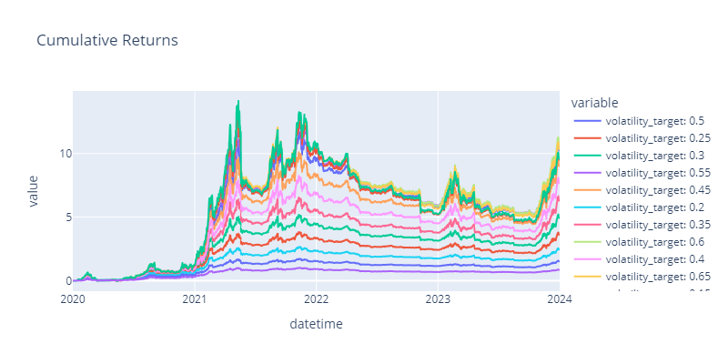

# Optimizing Parameters

A simple hyperparameter optimization procedure is supported by this repo. After specifying a parameter search space, the procedure will grid search the space and run a backtest over the same period (no subsampling) for each parameter set. The parameter sets are sorted based on the metric of interest (Sharpe Ratio by default) and the top 25 are plotted and returned.

Below is an example plot of the cumulative returns of various portfolios produced from optimizing over `volatility_target` in steps of 5%.



Optimization is run using a near-identical command to the [backtesting](./backtesting.md) command. In fact, the only difference is the replacement of `backtest` with `optimize`; all other user args remain the same.

```
bazel run //momentum:momentum -- optimize \
    --input_path {input_OHLCV_CSV_path} \
    --data_freq {OHLCV_timeframe} \
    --start_date {backtest_start_date} \
    --end_date {backtest_end_date} \
    --timezone {desired_timezone} \
    --params_path {params_YAML_path} \
    --initial_capital {initial_capital}
```

Refer to [Backtesting](./backtesting.md) for an explanation of the input args.


## Search Space Specification

A search space for a parameter can be specified in a few ways. This can be embedded into the same [params file used for backtesting](./backtesting.md#parameter-specification) so long as it succeeds (comes after) all previous mentions of the target parameter.


### 1. Single Value

```
volatility_target: 0.4
```

The key-value pair for a parameter can contain a single value. This will indicate that this parameter is meant to be kept fixed and will not be optimized over.


### 2. List of Values
```
volatility_target: [0.05, 0.1, 0.15, 0.2]
with_fees: [False, True]
```

A list of values can be specified for the parameter, in which case the optimizer will iterate over every value in the list for that parameter.

Note that all combinations of parameter values are evaluated. In the above example, $`2 \cdot 4 = 8`$ combinations of `(volatility_target, with_fees)` parameter sets would be evaluated.


### 3. `step_size` & `num_steps`
```
volatility_target:
    step_size: 0.05
    num_steps: 10
```
The key-value pair for a parameter can contain a dictionary which specifies `step_size` and `num_steps`. The optimizer will evaluate `num_steps` parameter values starting from `step_size`. In the above example, the values `[0.05, 0.1, 0.15, 0.2, ..., 0.5]` for `volatility_target` would be evaluated.


## Recommended Use Cases

Optimizing signal generation parameters in this fashion is not recommended, as it will typically produce brittle signals that have been overfit to the training data. Instead, some recommended use cases include the following.


### Optimizing the Rebalancing Buffer

The [rebalancing buffer](./backtesting.md#rebalancing-buffers) can be varied to study the performance tradeoff between frequent rebalancing and cost of increased trading for a pre-determined signal. Metrics of interest may include:

- Total number of trades / Total fees paid
- [Portfolio turnover](./backtesting.md#portfolio-turnover)
- Sharpe Ratio / Total Return as a measure of performance

 can also be measured to ensure that the resulting turnover from a given choice of `rebalancing_buffer` suits the target holding period of the portfolio.

A decision-making process of choosing the highest Sharpe with sensible fees / number of trades / turnover is probably reasonable.


### Optimizing the Volatility Target

The [volatility target](./signal-position-generation.md#volatility-targeting) can be varied to study how performance changes as a result. Some metrics of interest may include:

- How Max Drawdown (%) increases as the volatility target increases.
- Whether Sharpe Ratio remains constant as the volatility target increases. if not, this may indicate limited capacity.
- Whether the target volatility can still be met by the portfolio as the target increases. If not, this may indicate limited capacity.

Tuning for the highest Sharpe / absolute return given max acceptable drawdown is probably reasonable. Alternatively, this can be used simply to verify that a pre-determined volatility target is achievable.


### Varying Volume Constraints

[Min and max volume constraints](./backtesting.md#volume-constraints) can be varied to measure the performance impact of limiting the investable universe. This should primarily be used as a tool to confirm prior data analysis on the impact of volume on the explanability of your signal, rather than as a standalone optimization.


### Measuring Strategy Scaleability

Both the initial capital and the volatility target could be varied to get a rough sense of the scaleability of the strategy. One would examine how total return, realized volatility, and Sharpe vary as target size increases.

Varying initial capital affects portfolio size much more directly than varying target volatility. If performing actual hyperparameter optimization, it is recommended to vary one parameter at a time and to keep initial capital the same for all rounds.
